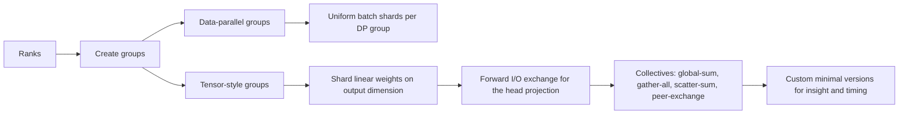

# Inside-ML-Systems

A hands-on exploration of **machine-learning systems**: optimizing fused compute kernels with a **GPU kernel DSL** and scaling training with a **message-passing runtime**. The focus is **performance**, **parallelism**, and **practical engineering**.

---

## 🎯 Goal

- **Kernel path**: Build and tune a fused kernel that computes `D = ReLU(A @ B + C)` using tiling, on-chip locality, and an epilogue that keeps data in registers until the final write.
- **Parallel path**: Implement **data-parallel** and **tensor-style** sharding along with core collectives on a message-passing backend (including your own lightweight versions).
- **Systems mindset**: Make decisions driven by memory hierarchy, precision, tile geometry, and communication patterns—not just algebra.

---

## 🗺️ Architecture Overview

### Compute path — fused matmul + add + activation


**Key ideas (expanded)**
- **Tile mapping**: assign output submatrices to programs so that loads and stores are contiguous; ceil-div ensures full coverage at boundaries.
- **On-chip locality**: stage A/B subtiles in fast memory to cut DRAM traffic; use cooperative fetching to amortize latency.
- **Register blocking**: keep partial sums in registers (accumulator tile) to maximize reuse and reduce spills.
- **Fused epilogue**: add bias/skip (`+C`) and activation **before** touching global memory; fewer launches, fewer round-trips.
- **Tuning levers**: `BLOCK_M/N/K`, warp count, multistage pipelining; balance occupancy vs. register pressure.

---

### Parallel path — sharding + collectives



**Key ideas (expanded)**
- **Data-parallel**: replicate weights, split batches; synchronize gradients with **global-sum** across data groups.
- **Tensor-style sharding**: split certain linear projections by output channels; gather/scatter activations so each shard sees what it needs.
- **Collectives taxonomy**:  
  - *global-sum* (aka reduce then broadcast),  
  - *gather-all* (aggregate full views),  
  - *scatter-sum* (reduce while distributing shards),  
  - *peer-exchange* (every rank talks to every rank).  
  Implement minimal versions to understand latency, bandwidth, and scheduling.
- **Topology & indexing**: arrange ranks **model-major** so tensor-style groups are contiguous; derive deterministic group IDs from rank.
- **Cost model**: know when you’re **bandwidth-bound** (large payloads) vs **latency-bound** (tiny payloads, many hops) and choose algorithms accordingly (e.g., ring vs tree-style).

---

## 🧩 What I Build

- **Fused kernel** in a GPU kernel DSL (matrix multiply + add + activation) with shared/register tiling and masked I/O.
- **Lightweight collectives** on a message-passing runtime: custom *global-sum* and *peer-exchange* alongside the built-ins.
- **Parallel glue**: data sharding, rank/group mapping, and forward/backward I/O collection for the output projection.

---

## 📂 Layout

```
project/
├─ kernels/
│  ├─ fused_mm_epilogue.ipynb       # main kernel and tuning
│  └─ utils.py                      # timing, data init, plots (optional)
├─ parallel/
│  ├─ comm_minimal.py               # custom global-sum, peer-exchange
│  ├─ runtime_tests.py              # small demos & timers
│  ├─ model/funcs.py                # group init, dims, fwd/bwd I/O
│  └─ data/sharding.py              # uniform data splits
├─ tests/
│  ├─ test_sharding.py
│  ├─ test_groups.py
│  ├─ test_forward.py
│  └─ test_backward.py
├─ requirements.txt
└─ README.md
```

---

## 🔧 Kernel — What Matters Most

- **Index math**: compute row/col offsets with arange-style vectors; build masks once, reuse often.
- **Memory access**: contiguous/coalesced loads; avoid bank conflicts by choosing tile strides that play nicely with the hardware.
- **Pipeline**: overlap loads with compute (multistage); pick `BLOCK_K` that feeds tensor units without bloating registers.
- **Numerics**: clamp/activate in registers; keep accumulation stable in half precision on this class of GPUs.

---

## 🔗 Parallel — What Matters Most

- **Groups**: deterministic creation of data groups and tensor groups from world size and rank; no hidden state.
- **I/O choreography**: for the output projection, collect partial activations, apply the sharded matvec, then assemble results.
- **Collectives**: compare built-ins vs your minimal versions to see where time goes (setup, copy, network).
- **Scaling hygiene**: measure message sizes, overlap comm with compute where safe, pin threads, and warm-start connections.

---

## ▶️ Quick Start (generic)

- **Kernel path**: open the notebook in `kernels/`, implement tiling + fusion, then sweep tile sizes and pipeline depth. Validate on square cases first (e.g., 2k×2k).
- **Parallel path**: run `parallel/runtime_tests.py` to sanity-check group splits and collective behavior on an 8-process run.

---

## 🧠 Why It Matters

End-to-end training speed is the product of **fast math** and **fast movement**.  
Fusing the epilogue trims memory traffic and launch overhead; choosing tile shapes that respect the memory hierarchy unlocks the math units. On the other side, **collective communication** turns many devices into one logical accelerator—if you pair the right algorithm with the right topology and payload size.

---
